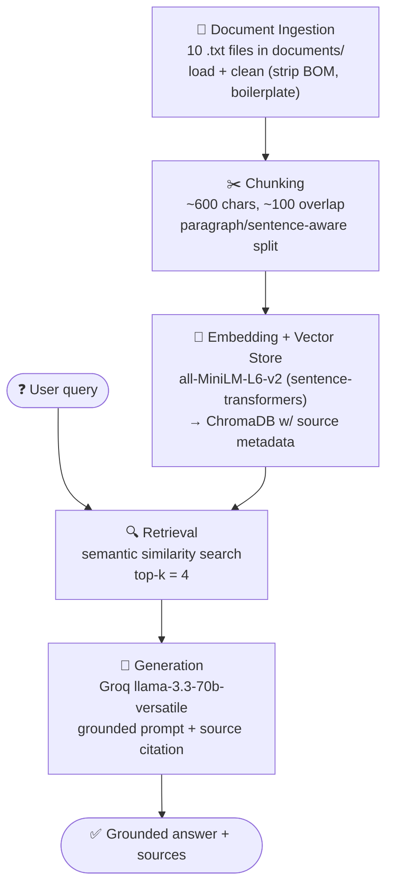

# Project 1 Planning: The Unofficial Guide

> Write this document before you write any pipeline code.
> Your spec and architecture diagram are what you'll use to direct AI tools (Claude, Copilot, etc.) to generate your implementation — the more specific they are, the more useful the generated code will be.
> Update the Retrieval Approach and Chunking Strategy sections if you change your approach during implementation.
> Update this file before starting any stretch features.

---

## Domain

My domain is Vanderbilt University dining hall experiences and student opinions about campus food options. This knowledge is valuable because students frequently rely on unofficial reviews and personal experiences when deciding where to eat, which meal plans are worthwhile, and which dining halls best fit their preferences. Much of this information is scattered across student newspapers, opinion magazines, and Reddit discussions, making it difficult to search and compare through official university resources alone.

---

## Documents

<!-- List your specific sources: URLs, subreddit names, forum threads, or file descriptions.
     Aim for at least 10 sources that together cover different subtopics or perspectives within your domain. -->

| # | Source | Description | URL or location |
|---|--------|-------------|-----------------|
| 1 | The Vanderbilt Hustler | Ranking of all 11 Vanderbilt dining options with pros & cons | https://vanderbilthustler.com/2023/04/23/a-ranking-of-vanderbilts-dining-options/ |
| 2 | The Vanderbilt Hustler | "Lots of change, some progress" — review of Campus Dining | https://vanderbilthustler.com/2022/09/27/lots-of-change-some-progress-a-review-of-campus-dining/ |
| 3 | The Vanderbilt Hustler | Student reviews of VandyCart / food beyond the dining hall | https://vanderbilthustler.com/2025/10/19/campus-food-beyond-the-dining-hall-student-reviews-of-vandycart/ |
| 4 | The Vanderbilt Hustler | "3 years of Campus Dining losses, ranked" (opinion) | https://vanderbilthustler.com/2024/09/01/3-years-of-campus-dining-losses-ranked/ |
| 5 | The Vanderbilt Hustler | Meal plan options updated after student feedback | https://vanderbilthustler.com/2024/10/20/dining-introduces-updated-meal-plan-options-following-student-feedback/ |
| 6 | The Vanderbilt Hustler | Recent changes to several dining locations (2026) | https://vanderbilthustler.com/2026/02/17/campus-dining-implements-changes-to-several-dining-locations/ |
| 7 | Vanderbilt Political Review | "Is the Vanderbilt Meal Plan Worth It?" — cost breakdown | https://vanderbiltpoliticalreview.com/6222/campus/is-the-vanderbilt-meal-plan-worth-it/ |
| 8 | Vanderbilt Business Review | All-you-care-to-eat vs. retail dining tradeoffs | https://vanderbiltbusinessreview.com/dining-halls-all-you-care-to-eat-vs-retail-dining/ |
| 9 | Reddit (r/Vanderbilt) | Student discussion thread on dining / meal plans (copy manually) | https://www.reddit.com/r/Vanderbilt/ (search "meal plan") |
| 10 | Reddit (r/Vanderbilt) | Student discussion thread on best/worst dining hall (copy manually) | https://www.reddit.com/r/Vanderbilt/ (search "dining hall") |

---

## Chunking Strategy

<!-- How will you split documents into chunks?
     State your chunk size (in tokens or characters), overlap size, and explain why those
     numbers fit the structure of your documents.
     A review-heavy corpus warrants different chunking than a long FAQ. -->

**Chunk size:** ~600 characters (target), split on paragraph/sentence boundaries rather than a hard character cut.

**Overlap:** ~100 characters between adjacent chunks.

**Reasoning:**

My corpus has two distinct shapes, and the chunking has to serve both:

- **Long-form articles** (e.g. the Hustler dining ranking, ~14KB): a useful fact about a single dining hall is usually concentrated in one paragraph buried in a much longer piece. I want each paragraph-sized idea to land in its own retrievable chunk.
- **Short Reddit comments** (whole threads are 2–4KB): each comment is already a complete, self-contained opinion, sometimes only 1–2 sentences.

~600 characters is roughly one substantial paragraph or 2–4 short Reddit comments. It's large enough that a chunk carries a complete thought (a full opinion about a hall, with its reasoning), but small enough that a specific query — "wait times at Rand" — isn't diluted by unrelated content packed into the same chunk.

I split on paragraph/sentence boundaries instead of a hard 600-character cut so I don't slice a sentence (or a reviewer's opinion) in half. A chunk that ends "Rand cookies are worth the wait, but the line—" is useless for retrieval.

The ~100-character overlap exists for facts that straddle a boundary: if one paragraph sets up "Commons is the worst dining hall" and the next explains *why*, the overlap keeps enough connective context that either chunk is still interpretable on its own.

**How I'll know it's wrong:** if retrieved chunks come back as sentence fragments or HTML leftovers, chunks are too small / cleaning failed. If a precise query keeps pulling chunks that are "mostly about something else," chunks are too large and I'll lower the target. I'll inspect 5 representative chunks in Milestone 3 before embedding and tune from there.

---

## Retrieval Approach

<!-- Which embedding model are you using (e.g., all-MiniLM-L6-v2 via sentence-transformers)?
     How many chunks will you retrieve per query (top-k)?
     If you were deploying this for real users and cost wasn't a constraint, what tradeoffs
     would you weigh in choosing a different embedding model — context length, multilingual
     support, accuracy on domain-specific text, latency? -->

**Embedding model:** `all-MiniLM-L6-v2` via sentence-transformers (runs locally, no API key, no rate limits).

**Top-k:** 4 to start, tuned after seeing real retrieval results.

**Production tradeoff reflection:**

`all-MiniLM-L6-v2` is a strong default for this project: it's free, fast, runs locally, and produces 384-dimensional embeddings that are plenty for a corpus this small. Semantic search works here because it matches on *meaning*, not exact words — a query like "is the food good" can retrieve a comment that says "the dishes are tasty" even though they share no keywords.

I'm starting at top-k = 4 because my chunks are ~600 chars: four of them gives the LLM enough context to synthesize an answer without burying the relevant chunk among loosely-related ones. Too few (k=1–2) risks missing the chunk that actually holds the answer; too many (k=10+) dilutes the context and can pull the response off-target. I'll tune this in Milestone 4 against my test queries.

If I were deploying this for real users and cost weren't the constraint, I'd weigh:
- **Accuracy on domain-specific text** — a larger model (e.g. OpenAI `text-embedding-3-large` or a fine-tuned domain model) would better distinguish near-duplicate opinions ("Rand is great" vs. "Rand is overrated").
- **Context length** — MiniLM truncates at 256 tokens, which is fine for my 600-char chunks but would clip longer documents; a model with a larger input window would let me chunk less aggressively.
- **Multilingual support** — not needed for an English-only campus corpus, but a multilingual model would matter for an international student audience.
- **Local vs. API / latency** — local MiniLM means no per-query cost and full data privacy; an API model adds latency and recurring cost but offloads compute and tends to be more accurate. For a free student project, local wins; at scale, I'd reconsider.

---

## Evaluation Plan

<!-- List your 5 test questions with their expected correct answers.
     Questions should be specific enough that you can judge whether the system's response
     is right or wrong. "What are good dining halls?" is too vague.
     "What do students say about wait times at [dining hall name] during lunch?" is testable. -->

| # | Question | Expected answer |
|---|----------|-----------------|
| 1 | Which dining hall did the Hustler rank #1 overall, and what specific item is given as a reason? | Rand Dining Center is ranked #1, praised for consistency, options, and central location; **Rand cookies** are called "easily the best snack on campus" and worth the wait. *(hustler_dining_ranking)* |
| 2 | According to the Vanderbilt Political Review, what do Vanderbilt freshmen pay per meal vs. the average American, and what premium does that represent? | Freshmen pay **$7.42/meal** and upperclassmen on a 14-meal plan pay **$9.55/meal**, vs. the average American's **$2.42/meal** — up to a **~394% premium** (400% for Kissam residents). *(political_review_mealplan)* |
| 3 | What's the difference between Residential Dining Halls and Retail Dining, and which do students tend to see as higher quality? | Residential halls (Commons, EBI, Zeppos, Rothschild) are **all-you-care-to-eat** (one swipe, unlimited); Retail (2301, Kissam, Rand, The Pub) limits you to **one entrée + side + drink per swipe**. Students generally view **Retail as higher quality**, while Residential offers more variety/quantity. *(business_review_aycte_vs_retail)* |
| 4 | What three-swipe-per-day limit did Campus Dining add in 2026, and at which locations? | A **three-meal-swipe-per-day limit** at associate operator locations: **Suzie's, Wasabi, VandyBlenz, Holy Smokes, and Grins**. *(hustler_dining_changes_2026)* |
| 5 | Which dining hall do students say has the worst / lowest-quality food? | The Reddit thread names **Kissam** — "overall food quality is pretty bad, more misses than hits," and they "overcook" the food. *(reddit_dining_hall_thread)* — **Note:** likely failure/partial case: the Hustler ranking puts **2301 last (#11)** but explicitly says that's *not* due to food quality, so retrieval may surface conflicting "worst" signals. |

---

## Anticipated Challenges

<!-- What could go wrong? Name at least two specific risks with reasoning.
     Consider: noisy or inconsistent documents, missing source attribution, off-topic
     retrieval, chunks that split key information across boundaries. -->

1. **Conflicting opinions across sources.** Reddit comments and student-paper articles often disagree (one reviewer loves Rand, another calls the lines unbearable). The retriever may surface contradictory chunks, and the LLM has to represent that disagreement honestly rather than picking one side or averaging them into a bland non-answer. I'll need to test queries where sources genuinely conflict.

2. **Hallucination / weak grounding on out-of-scope queries.** My corpus covers dining, so a question it doesn't address (e.g. a specific 2026 menu item, or a hall not reviewed in my sources) risks the LLM falling back on its general training knowledge and inventing a plausible answer. The grounding prompt must force an explicit "I don't have enough information" response, and I'll test this directly.

3. **Boundary-split facts in long articles.** In the long Hustler pieces, a hall's verdict and its justification can land in adjacent chunks. If only one is retrieved, the answer is half-complete. This is what my 100-char overlap is meant to mitigate, but I'll verify it actually works during retrieval testing.

4. **Stale / time-sensitive content.** Several sources span 2022–2026 and dining options change (halls open, menus update). A chunk from 2022 may contradict a 2026 one. Source attribution with dates helps users judge, but the system itself won't know which is current.

---

## Architecture

<!-- Draw a diagram of your pipeline showing the five stages:
     Document Ingestion → Chunking → Embedding + Vector Store → Retrieval → Generation
     Label each stage with the tool or library you're using.
     You can use ASCII art, a Mermaid diagram, or embed a sketch as an image.
     You'll use this diagram as context when prompting AI tools to implement each stage. -->

---

## AI Tool Plan

<!-- For each part of the pipeline below, describe:
     - Which AI tool you plan to use (Claude, Copilot, ChatGPT, etc.)
     - What you'll give it as input (which sections of this planning.md, which requirements)
     - What you expect it to produce
     - How you'll verify the output matches your spec

     "I'll use AI to help me code" is not a plan.
     "I'll give Claude my Chunking Strategy section and ask it to implement chunk_text()
     with my specified chunk size and overlap" is a plan. -->

I'm using **Claude (Claude Code)** as my primary AI tool. My approach throughout is to feed it the relevant sections of this planning.md plus the architecture diagram, have it generate code that matches my spec, then read and correct the output before relying on it. I treat AI as an implementer of *my* decisions, not a decision-maker.

**Milestone 3 — Ingestion and chunking:**
- **Tool:** Claude.
- **Input:** My Documents section (10 `.txt` files in `documents/`, mixed long-form articles + short Reddit threads), my Chunking Strategy section (~600 chars, ~100 overlap, paragraph/sentence-aware), and a note that files start with a UTF-8 BOM and contain leftover author bios / "About the Contributors" boilerplate that needs cleaning.
- **Expect it to produce:** a script that loads every file in `documents/`, strips the BOM and trailing author-bio boilerplate, and a `chunk_text()` function that splits on paragraph/sentence boundaries to my target size + overlap, attaching the source filename to each chunk.
- **How I'll verify:** print 5 representative chunks and confirm they're self-contained, BOM/boilerplate-free, and tagged with the right source; check total chunk count is in the 50–2,000 range.

**Milestone 4 — Embedding and retrieval:**
- **Tool:** Claude.
- **Input:** My Retrieval Approach section (all-MiniLM-L6-v2, top-k = 4) and the architecture diagram (ChromaDB as the store).
- **Expect it to produce:** code that embeds all chunks with `SentenceTransformer("all-MiniLM-L6-v2")`, loads them into ChromaDB with source + chunk-position metadata, and a `retrieve(query, k)` function returning the top-k chunks with their sources and distance scores.
- **How I'll verify:** run 3 of my 5 evaluation questions, print returned chunks + distance scores, and confirm top results are on-topic with distances below ~0.5. If not, debug chunking before adding generation.

**Milestone 5 — Generation and interface:**
- **Tool:** Claude.
- **Input:** My grounding requirement (answer from retrieved context only; say "I don't have enough information" otherwise), my desired output format (answer + source list), and the Gradio skeleton from the assignment.
- **Expect it to produce:** a prompt template that hard-enforces grounding, an `ask(question)` function wiring retrieval → Groq `llama-3.3-70b-versatile` → grounded answer with source attribution appended programmatically, and a Gradio app exposing question input + answer/sources outputs.
- **How I'll verify:** test an out-of-scope question (must refuse, not invent) and a covered one (answer must trace to retrieved chunks with correct citations). Confirm sources are added in code, not left to the LLM.
